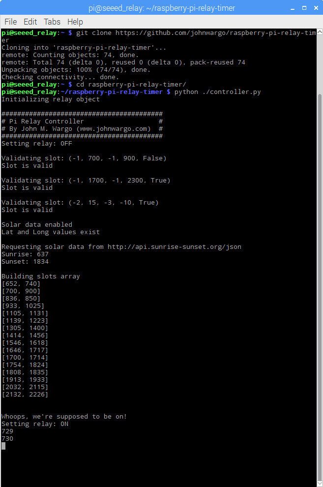

# Raspberry Pi Relay Timer

Kielbasa strip steak doner frankfurter beef sirloin. Ribeye flank brisket cupim chicken pancetta shoulder drumstick fatback. Ground round frankfurter kevin salami, kielbasa drumstick bacon beef ribs venison shoulder fatback. Meatloaf sausage jerky t-bone meatball pastrami. Brisket shoulder corned beef, tenderloin meatball short loin venison rump. Fatback hamburger alcatra pork loin short ribs, cupim andouille leberkas ham. Jerky pork belly meatloaf picanha.

Beef ribs cupim pancetta, jerky frankfurter jowl swine cow sirloin leberkas tail. Tongue meatball tri-tip ball tip. Short ribs boudin sirloin chuck. Venison t-bone leberkas picanha, shoulder rump sausage.  

## Hardware Components

To use this project, you'll need at a minimum the following hardware components:

+ [Raspberry Pi 3](https://www.raspberrypi.org/products/raspberry-pi-3-model-b/)
+ A compatible relay/relay board
+ 5V, 2.5A Micro USB power source (basically, a smartphone charger) - I use the [CanaKit 5V 2.5A Raspberry Pi 3 Power Supply/Adapter/Charger](https://www.amazon.com/gp/product/B00MARDJZ4)
 
For the relay, I used the [1-channel relay board](http://www.yourduino.com/sunshop/index.php?l=product_detail&p=181) from yourduino.com. The boards they're selling now are different than the ones I had lying around. They have a really good [relay tutorial](http://arduino-info.wikispaces.com/ArduinoPower) on their web site; even though it's geared primarily at Arduino users, it's still a lot of good information. Amazon.com also has a good [selection of relay boards](https://www.amazon.com/s/ref=nb_sb_noss_1?url=search-alias%3Daps&field-keywords=1+channel+relay) you can use as well.

## Configuring Your Raspberry Pi

Download the latest version of the Raspbian OS from the [Raspberry Pi web site](https://www.raspberrypi.org/downloads/raspbian/) and follow the [instructions](https://www.raspberrypi.org/documentation/installation/installing-images/README.md) for writing the OS image to a Micro SD card for the Pi. Insert the **SD card** in the Pi, connect **Ethernet**, **keyboard**, **mouse**, and a **monitor** to the Pi and finally **power it up** using a smartphone charger or some suitable power source.

The first thing you'll want to do is open the **Raspberry Pi menu** (in the upper-left corner of the screen), select **Preferences**, then **Raspberry Pi Configuration** as shown in the following figure:

Raspbian comes configured with its keyboard, timezone, and other locale settings configured for the United Kingdom (UK), so if you're in the US, or elsewhere that's not the UK, you'll want to switch over to the **localisation** tab and adjust the settings there as well.

When you're done configuring locale settings, you'll likely be prompted to reboot the Pi. Go ahead and do that before continuing. 

When the Pi comes back up, open a terminal window and execute the following command:

	sudo apt-get update

This updates the local catalog of applications. Next, execute the following command:

	sudo apt-get upgrade

This command will update the Raspbian OS with all updates released after the latest image was published. The update process will take a long time, so pay attention, answer any prompts, and expect this process to take a few minutes or more (the last time I did this, it took about 15 minutes or more to complete).

    sudo pip install pytz tzlocal
        
Now, lets download and project code; in the terminal window, execute the following command:

	git clone https://github.com/johnwargo/Raspberry-Pi-Relay-Timer

This will download the project's code from its Github repository and copy the files to the local (relative to your terminal window) `Raspberry-Pi-Relay-Timer` folder. 

## Customizing the Controller's Time Slots

## Starting the Controller

Next, change to the folder you just created by executing the following command:

	cd Raspberry-Pi-Relay-Timer

Your terminal window prompt should change to reflect the switch to the new folder. Now, let start the server application. In the terminal window pointing to the `Raspberry-Pi-Relay-Timer` folder (you changed to this folder with the last command you typed), execute the following command:

	python ./controller.py

The controller process will start and begin managing the relay using the time slots you selected.

 
## Starting The Controller Server Process Automatically

Right now, the server is only running because you started it manually. There are a few steps you must complete to configure the Raspberry Pi so it executes the the relay controller app on startup. You can read more about this here: [Autostart Python App on Raspberry Pi in a Terminal Window](http://johnwargo.com/index.php/microcontrollers-single-board-computers/autostart-python-app-on-raspberry-pi-in-a-terminal-window.html).

If you don't already have a terminal window open, open one then navigate to the folder where you extracted the project files (if you followed these instructions, it should be at `home/pi/Raspberry-Pi-Relay-Timer`. 

1.	Make the project's bash script file (`start-controller.sh`) executable by executing the following command:

    	chmod +x start-controller.sh
    
2.	Open the pi user's session autostart file using the following command:  

		sudo nano ~/.config/lxsession/LXDE-pi/autostart    

3.	Add the following line to the end (bottom) of the file:

		@lxterminal -e /home/pi/Raspberry-Pi-Relay-Timer/start-controller.sh

	To save your changes, press `ctrl-o` then press the Enter key. Next, press `ctrl-x` to exit the `nano` application.
  
4.	Reboot the Raspberry Pi; when it restarts, the controller server process should execute in its own terminal window.

## Update History

Nothing yet.

***
By [John M. Wargo](http://www.johnwargo.com) - If you find this code useful, and feel like thanking me for providing it, please consider making a purchase from [my Amazon Wish List](https://amzn.com/w/1WI6AAUKPT5P9). You can find information on many different topics on my [personal blog](http://www.johnwargo.com). Learn about all of my publications at [John Wargo Books](http://www.johnwargobooks.com). 